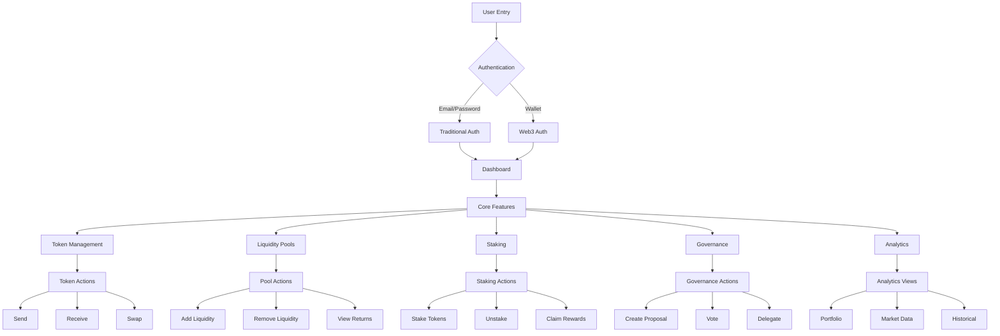
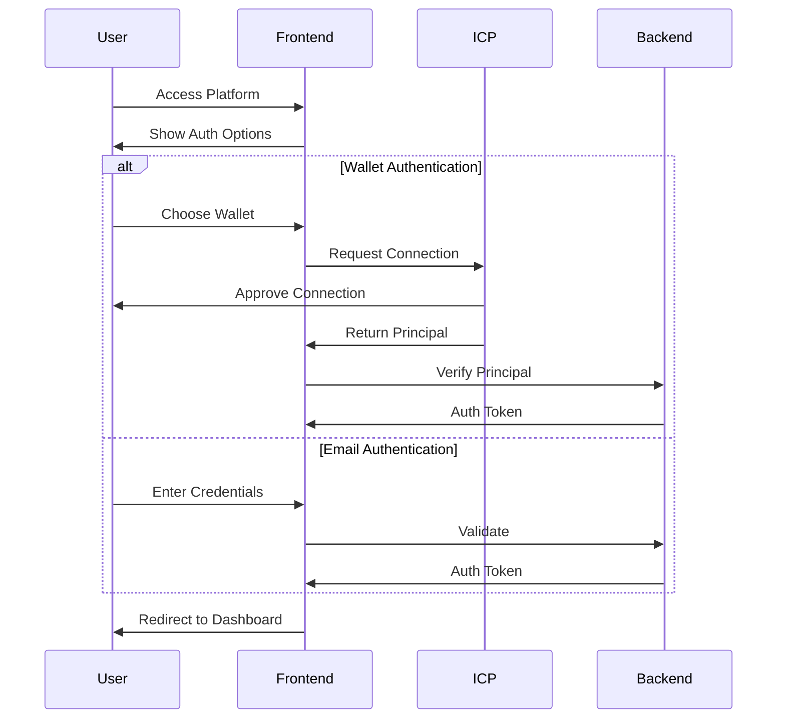
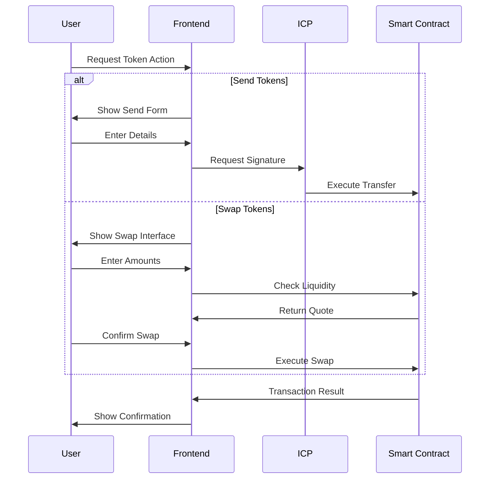
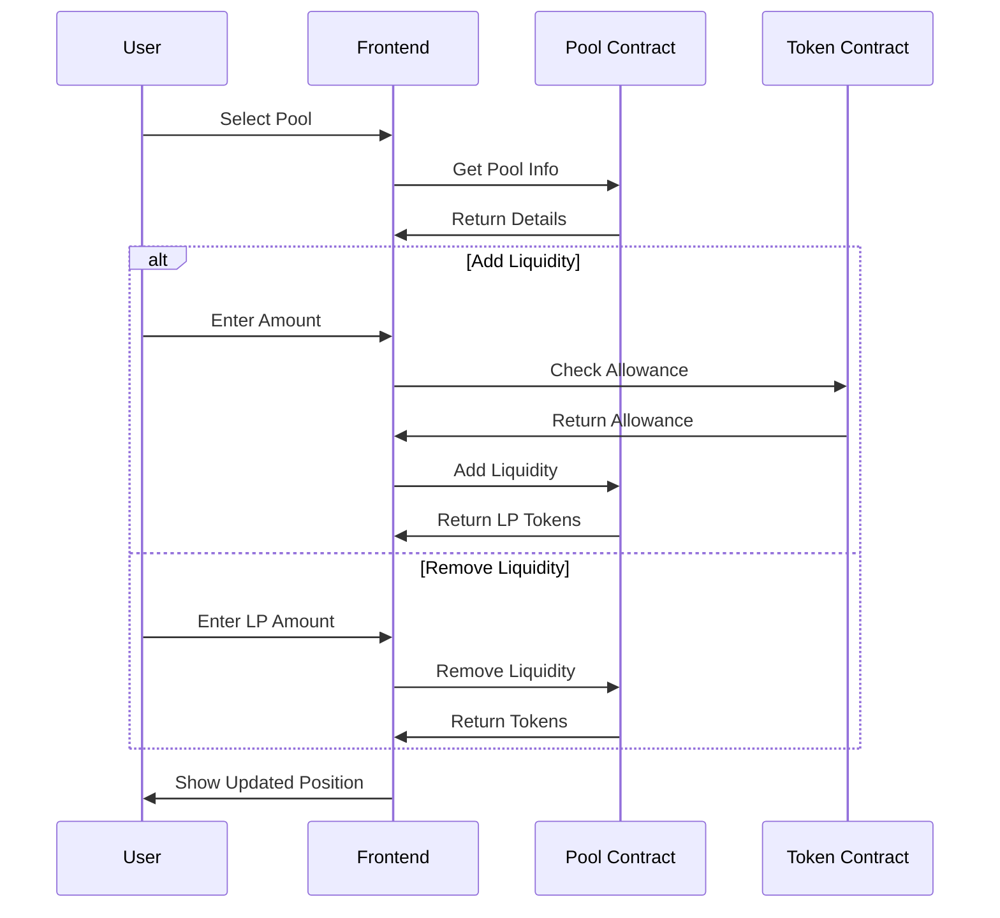

# DAFI DeFi Platform Architecture

## System Overview



## Authentication Flow



## Token Management Flow



## Liquidity Pool Flow



## Directory Structure

```
dafi-web3/
├── src/
│   ├── components/
│   │   ├── auth/
│   │   │   ├── AuthForm.tsx
│   │   │   └── WalletConnect.tsx
│   │   ├── layouts/
│   │   │   ├── DashboardLayout.tsx
│   │   │   ├── TopNavigation.tsx
│   │   │   └── Layout.tsx
│   │   ├── profile/
│   │   │   ├── ProfileForm.tsx
│   │   │   ├── SecuritySettings.tsx
│   │   │   └── WalletSettings.tsx
│   │   └── defi/
│   │       ├── TokenManagement.tsx
│   │       ├── LiquidityPools.tsx
│   │       ├── Staking.tsx
│   │       └── Governance.tsx
│   ├── pages/
│   │   ├── login.tsx
│   │   ├── register.tsx
│   │   ├── dashboard/
│   │   └── defi/
│   ├── contexts/
│   │   ├── AuthContext.tsx
│   │   └── Web3Context.tsx
│   └── services/
│       ├── auth.ts
│       ├── wallet.ts
│       └── api.ts
└── docs/
    └── ARCHITECTURE.md
```

## Key Features

1. **Authentication**
   - Traditional email/password
   - Web3 wallet integration
   - Multi-wallet support
   - Session management

2. **Token Management**
   - Send/Receive tokens
   - Token swaps
   - Portfolio tracking
   - Transaction history

3. **Liquidity Pools**
   - Pool creation
   - Liquidity provision
   - Yield farming
   - Pool analytics

4. **Staking**
   - Token staking
   - Reward distribution
   - Lock periods
   - APY calculation

5. **Governance**
   - Proposal creation
   - Voting system
   - Delegation
   - DAO treasury

6. **Analytics**
   - Portfolio tracking
   - Market analysis
   - Historical data
   - Performance metrics

## Security Considerations

1. **Wallet Security**
   - Secure key storage
   - Transaction signing
   - Rate limiting
   - Fraud detection

2. **Smart Contract Security**
   - Audited contracts
   - Multi-sig wallets
   - Emergency stops
   - Upgrade mechanisms

3. **User Security**
   - 2FA authentication
   - Email verification
   - Session management
   - Activity monitoring

## Integration Points

1. **Internet Computer**
   - Smart contracts
   - Identity management
   - Token standards
   - Cross-canister calls

2. **External Services**
   - Price oracles
   - Market data
   - Analytics providers
   - Identity verification

3. **Wallet Providers**
   - Internet Identity
   - Plug Wallet
   - NFID
   - Stoic Wallet
